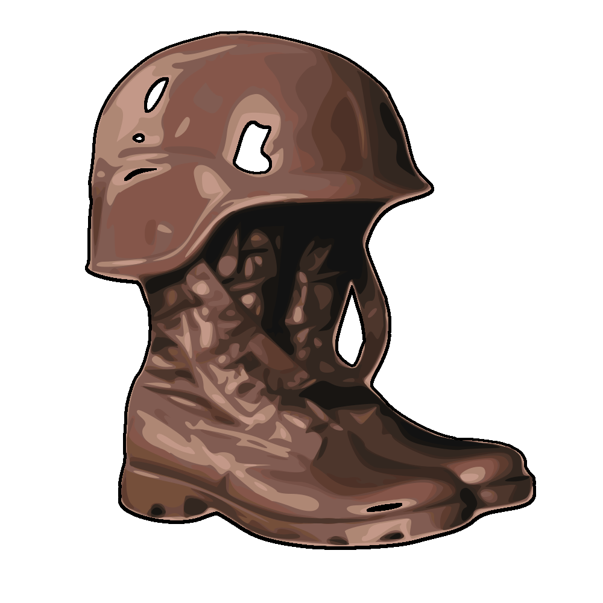

<html>

<head>
   <title>MilTrails 15K 00</title>
   <link rel="icon" type="image/x-icon" href="https://github.com/Merlinc01/miltrails/blob/f87d62ac1c34ba8e1b8392fdef00ef7be243d578/mt-15k/miltrails.ico">
   
</head>

<body>
   <table>
      <caption>
         MilTrails 16K [RED] 
      </caption>
      <tr>
         <th>Current position [00]</th>
         <th>Next waypoint [01]</th>
      </tr>
      <tr>
         <td>31U ES 65568 27879</td>
         <td>31U ES 66644 27540</td>
      </tr>
      <tr>
         <td>Start / End</td>
         <td>Little Bridge</td>
      </tr>
   </table>
</body>

</html>
